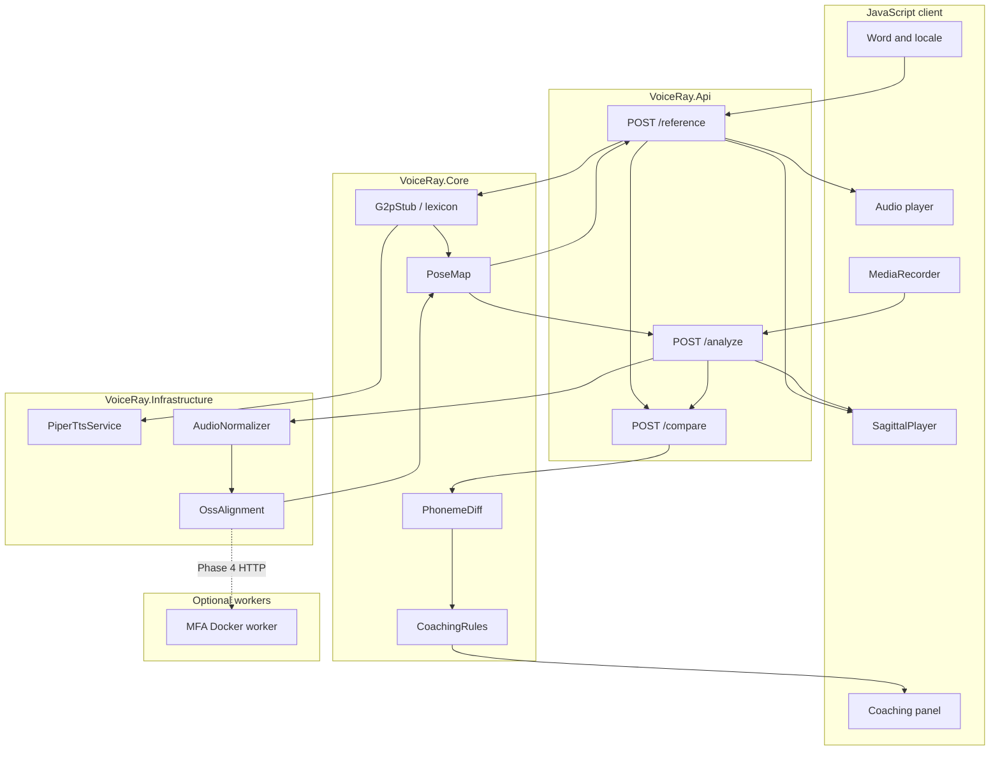

# VoiceRay architecture

> System design reference for the VoiceRay Web MVP. Product roadmap and phased delivery live in [`plan.md`](plan.md). API shapes live in [`api.md`](api.md).

## Overview

VoiceRay is a **hybrid web app**: an **F# .NET 10** backend owns phonetics, speech I/O, alignment, diff, and coaching; a **Vite + JavaScript** frontend owns UI, microphone capture, audio playback, and **layered sagittal SVG animation** traced from [`assets/vocal-tract/reference.png`](../assets/vocal-tract/reference.png).

The MVP epic runs **local OSS speech only** (`Speech:Provider = Local`): Piper TTS, Whisper/MFA alignment stubs. Azure Speech is deferred — see [`providers.md`](providers.md).



## Repository layout

| Path | Role |
| ---- | ---- |
| `src/VoiceRay.Api/` | ASP.NET Core host, minimal API endpoints, CORS, static media |
| `src/VoiceRay.Core/` | Pure F#: contracts, G2P stub, pose map, pipelines, diff, coaching |
| `src/VoiceRay.Infrastructure/` | Piper CLI, WAV normalize, OSS alignment selection |
| `client/` | Vite app: API client, `SagittalPlayer`, practice/record/compare screens |
| `client/public/vocal-tract.svg` | Layered sagittal rig (named SVG groups) |
| `assets/vocal-tract/reference.png` | Source art for trace |
| `models/` | Gitignored Piper binaries and voices (`scripts/provision-piper.ps1`) |
| `workers/mfa/` | Optional Montreal Forced Aligner Docker worker (Phase 4 stub) |
| `docs/` | Plan, architecture, API, providers, articulatory model, status |

## Responsibility split

| Concern | Backend (F#) | Frontend (JS) |
| ------- | ------------- | --------------- |
| G2P / IPA timelines | Yes | Display only |
| Reference TTS (Piper) | Yes; serves `/media/reference/*.wav` | Play audio |
| User recording ingest | Yes (`POST /analyze`, 16 kHz mono WAV) | `MediaRecorder` upload |
| Forced alignment | Yes (Whisper cache path or MFA stub/worker) | Shows engine metadata banner |
| IPA → articulatory keyframes | Yes (`PoseMap`) | `SagittalPlayer` applies layers |
| Phoneme diff + coaching | Yes | Compare UI + ghost overlay |
| SVG tweening / scrubbing | — | Primary (50–80 ms interpolation) |
| Secrets / API keys | `appsettings`, user secrets | None (same-origin API) |

## Core pipelines

### Reference (`POST /api/v1/reference`)

1. Validate `text` + BCP-47 `locale`.
2. `G2pStub.tryLookup` → IPA symbol list (MVP: **10 demo words**, `en-US` only).
3. `PiperTtsService` synthesizes WAV; duration drives timeline.
4. `ReferencePipeline.buildSession` → `PhonemeSegment[]` + `ArticulatoryKeyframe[]` via `PoseMap`.
5. Response includes `audioUrl`, phonemes, keyframes, `ipaDisplay`.

### Analyze (`POST /api/v1/analyze`)

1. Multipart WAV normalized to 16 kHz mono.
2. G2P from reference text (same lexicon).
3. `OssAlignment.align`: prefers **Whisper** when `%USERPROFILE%\.cache\whisper\` exists (or configured cache); else **MFA stub** (slight boundary nudge for metadata).
4. `AnalyzePipeline.buildSession` → user phonemes, keyframes, scores placeholder, `metadata` (engine, device, banner).

### Compare (`POST /api/v1/compare`)

1. Greedy IPA alignment between reference and user `PhonemeSegment[]`.
2. `CoachingRules.forSegments` for substitutions (MVP: `en-US` rule table).
3. Returns `segments` + `coaching` for UI overlay.

## Locale matrix (MVP vs Phase 4)

BCP-47 tags are carried on every API request. Implementation depth varies by locale pack.

| Locale | G2P / lexicon | Pose map | Coaching rules | TTS voice | Alignment dictionary | Status |
| ------ | ------------- | -------- | ---------------- | --------- | -------------------- | ------ |
| `en-US` | 10-word demo lexicon (`G2pStub.fs`) | `PoseMap.enUsMap` | `CoachingRules` | Piper `en_US-lessac-medium` | Whisper cache / MFA stub | **Shipped (MVP)** |
| `en-GB` | Planned CMU + variant IPA | Extend `PoseMap` | Extend rules | Piper en-GB voice | MFA acoustic model | Phase 4 |
| `es-ES` | Planned locale pack | New poses | New rules | Piper es voice | MFA / Whisper | Phase 4 |
| `fr-FR` | Planned locale pack | New poses | New rules | Piper fr voice | MFA / Whisper | Phase 4 |

**Phase 4 target:** `VoiceRay.Core/locales/` packs (lexicon JSON + pose overrides + coaching tables) loaded by locale key without duplicating pipeline code.

**Frontend note:** Until packs ship, reject or disable non–`en-US` locales in UI; API returns `400` for unsupported locales per [`api.md`](api.md).

## Speech and alignment configuration

Server-side only (`src/VoiceRay.Api/appsettings.json`):

- `Speech:Provider` — `Local` (MVP default).
- `Speech:Piper` — executable, voice model, `MediaRoot`.
- `Speech:Alignment:Provider` — `Whisper` | `Mfa`.
- `Speech:Alignment:Whisper:CacheDir` — empty → `%USERPROFILE%\.cache\whisper\`.
- `Speech:Alignment:Mfa:WorkerUrl` — base URL for Docker worker (Phase 4); empty → in-process MFA stub.

See [`providers.md`](providers.md) for provisioning paths and MFA worker stub.

## Animation contract

Backend emits `ArticulatoryKeyframe` JSON: per-phoneme window with `layers` map (`lips_upper`, `tongue`, `velum`, …) using SVG `transform` and/or path `d`. Frontend `SagittalPlayer` applies poses and interpolates between keyframes.

Compare mode overlays **reference** keyframes (ghost) vs **user** keyframes on the **same** rig — see [`articulatory-model.md`](articulatory-model.md).

## Phase 4 (multilingual + self-host)

From [`plan.md`](plan.md) Phase 4:

1. Locale packs under `VoiceRay.Core/locales/`.
2. MFA Docker worker (`workers/mfa/`) + HTTP client in Infrastructure (replace `MfaStub` timing).
3. PWA manifest for installable client.

MVP intentionally keeps Azure Speech SDK out of the epic.

## CI and local dev

```text
dotnet run --project src/VoiceRay.Api
cd client && npm run dev
```

CI: `dotnet build/test`, `npm run build` (+ client unit tests). Full workflow gates: [`instructions.md`](instructions.md).

## Related documents

| Document | Contents |
| -------- | -------- |
| [`plan.md`](plan.md) | Phased delivery, risks, success metrics |
| [`api.md`](api.md) | REST contract |
| [`articulatory-model.md`](articulatory-model.md) | SVG layers, IPA pose legend, demo words |
| [`providers.md`](providers.md) | Piper, Whisper, MFA worker |
| [`status.md`](status.md) | Parallel agent run log |
