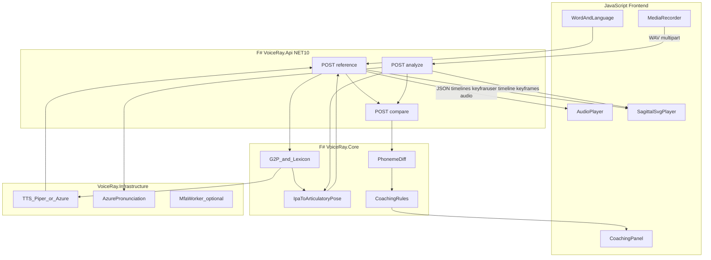

# VoiceRay — F# backend + JS frontend plan

## Context

The VoiceRay repository is **greenfield**. Confirmed choices:

- **Platform:** Web app first (PWA later)
- **Stack:** Hybrid — OSS core + optional cloud APIs (Azure Speech)
- **Architecture (updated):** **F# on .NET 10** does most processing; **JavaScript** frontend handles UI, mic capture, audio playback, and **SVG animation** of the sagittal vocal tract
- **Visual reference:** User-provided side-view cutout (sagittal head/neck, grey anatomy on black cavities) — this is the rig to animate, not a generic avatar or 3D viseme head

The cutout is well-suited to **layered SVG**: distinct regions for lips, teeth, tongue, velum/soft palate, hard palate, pharynx, and glottal area. Black regions are cavities (oral/nasal/pharyngeal); grey shapes morph or translate per phoneme.

---

## Product architecture



**Division of responsibility**

| Concern | Backend (F#) | Frontend (JS) |
| ------------------------ | -------------------------- | --------------------------------------------------------------- |
| G2P, IPA timelines | Yes | Display only |
| TTS / reference audio | Yes (stream or base64 URL) | Play audio |
| User phoneme alignment | Yes (Azure / MFA) | Upload WAV |
| IPA → articulatory poses | Yes | Apply poses to SVG |
| Diff + coaching text | Yes | Render compare UI |
| SVG path math / tweening | Optional validation | **Primary** — smooth 50–80ms interpolation (GSAP or native SVG) |
| API keys / secrets | `User Secrets` / env | None (calls same-origin API) |

---

## Sagittal vocal-tract animation (your reference image)

**Asset pipeline (Phase 1)**

1. Store source art in [`assets/vocal-tract/reference.png`](../assets/vocal-tract/reference.png) (your attached cutout).
2. **Trace** into [`client/public/vocal-tract.svg`](../client/public/vocal-tract.svg) (or separate layer files) with named groups:

| SVG layer ID | Animates? | Phonetic role |
| ---------------------------- | --------- | ---------------------------------------------------------- |
| `outline` | No | Skull, nose profile, neck frame |
| `teeth_upper`, `teeth_lower` | Jaw group | Landmarks for dental/alveolar contact |
| `lips_upper`, `lips_lower` | Yes | Bilabial, rounding, spreading |
| `jaw` | Yes | Open/close aperture (rotates/translates lower lip + teeth) |
| `tongue` | Yes | Tip/blade/root poses (path morph or transform anchors) |
| `velum` | Yes | Nasal vs oral (up = sealed, down = nasal) |
| `palate` | No | Hard palate reference |
| `glottis_hint` | Optional | Voiced vs voiceless indicator (simple open/closed) |

3. Define a **neutral pose** matching the reference PNG resting articulation.
4. Backend emits `ArticulatoryKeyframe[]` per phoneme segment:

```json
{
  "ipa": "t",
  "startMs": 120,
  "endMs": 180,
  "layers": {
    "lips_upper": { "transform": "..." },
    "lips_lower": { "transform": "..." },
    "jaw": { "d": "M ... path morph ..." },
    "tongue": { "d": "M ..." },
    "velum": { "transform": "..." }
  },
  "highlight": ["tongue_tip", "alveolar"]
}
```

5. **Compare mode:** frontend overlays reference keyframes (ghost, e.g. 40% opacity green) vs user keyframes (amber) on the same SVG — no second rig required.

**Pose library:** `VoiceRay.Core` holds `Map<Locale * IPA, ArticulatoryPose>` — discrete pedagogical targets (not biomechanical simulation). Start with ~15–25 tongue positions + lip presets for `en-US`, keyed to IPA; extend per locale.

**Libraries (frontend):** GSAP (MorphSVG plugin or transform tweens) or lightweight manual `requestAnimationFrame` interpolation between backend keyframes.

---

## Tech stack

| Layer | Choice | Rationale |
| --------------------- | ----------------------------------------------------- | ------------------------------------------------------------ |
| Backend runtime | **.NET 10** | User requirement |
| Backend language | **F#** | Strong fit for phoneme maps, pipelines, discriminated unions |
| API host | **ASP.NET Core** minimal APIs or **Giraffe** | Standard OSS hosting, OpenAPI |
| Domain | **VoiceRay.Core** (F# library) | Pure phonetics/diff/coaching |
| Infrastructure | **VoiceRay.Infrastructure** | Azure Speech SDK, Piper CLI, MFA worker HTTP client |
| Frontend | **Vite + TypeScript/JavaScript** | Thin client; no business logic duplication |
| Reference TTS (local) | **Piper** (or similar) invoked from Infrastructure | Server-side OSS audio; align with phoneme dictionary |
| Reference TTS (cloud) | **Azure Neural TTS** + viseme events | Hybrid quality path |
| User analysis (cloud) | **Azure Pronunciation Assessment** (`Phoneme`, `IPA`) | Phoneme scores + miscues |
| User analysis (local) | **MFA** optional Docker worker | Privacy/self-host; called from Infrastructure |
| Animation | **Layered SVG** from your cutout | Matches product vision |
| License | **MIT** + `NOTICE` | OSS learning tool |

**Secrets:** `appsettings.Development.json` + User Secrets on API only. Frontend uses `VITE_API_BASE_URL` pointing at local API or deployed host.

**Removed from prior plan:** pnpm `packages/phonetics`, in-browser HeadTTS, Node Express proxy — logic moves to F#.

---

## API contract (backend owns types)

Shared JSON shapes (document in `api.md`, optionally generate OpenAPI from ASP.NET):

- `POST /api/v1/reference` — body: `{ text, locale }` → `{ audioUrl | audioBase64, phonemes: PhonemeSegment[], keyframes: ArticulatoryKeyframe[], ipaDisplay }`
- `POST /api/v1/analyze` — multipart: `audio` (16 kHz mono WAV), `text`, `locale` → `{ phonemes, keyframes, scores, audioEcho? }`
- `POST /api/v1/compare` — body: `{ referencePhonemes, userPhonemes, locale }` → `{ segments: CompareSegment[], coaching: CoachingMessage[] }`

F# types (discriminated unions):

```fsharp
type PhonemeSegment = { Ipa: string; StartMs: int; EndMs: int }
type ArticulatoryKeyframe = { Ipa: string; StartMs: int; EndMs: int; Layers: Map<string, LayerPose> }
type CompareSegment = Match | Substitution of ref: string * user: string | Omission | Insertion
```

---

## F# solution structure

```
VoiceRay/
├── VoiceRay.sln
├── src/
│   ├── VoiceRay.Api/              # ASP.NET Core, endpoints, CORS, static files optional
│   ├── VoiceRay.Core/             # G2P, pose maps, diff, coaching rules
│   └── VoiceRay.Infrastructure/   # Azure Speech, Piper, MFA client, audio normalize
├── client/                        # Vite JS app
│   ├── src/
│   │   ├── api/client.js
│   │   ├── animation/SagittalPlayer.js
│   │   └── screens/...
│   └── public/vocal-tract.svg
├── assets/vocal-tract/
│   └── reference.png              # User cutout (source of truth for trace)
├── workers/mfa/                   # Optional Docker (Phase 4)
├── docs/
│   ├── plan.md                    # This document
│   ├── architecture.md
│   ├── api.md
│   ├── providers.md
│   └── articulatory-model.md      # Layer legend + IPA pose table
└── .github/workflows/ci.yml       # dotnet test + client lint/build
```

**Core modules (F#)**

- `Phonetics.G2P` — locale lexicons (e.g. CMU for `en-US`), fallback G2P
- `Phonetics.PoseMap` — `ipaToKeyframes : Locale -> IPA -> ArticulatoryKeyframeTemplate`
- `Phonetics.Timeline` — merge TTS viseme/phoneme timings into `PhonemeSegment[]`
- `Assessment.Diff` — align reference vs user segments (DTW or greedy IPA alignment)
- `Assessment.Coaching` — rule table `(locale, refIpa, userIpa) -> message + highlight layers`

**Infrastructure**

- `AzureSpeechTtsService` — synthesis + viseme/phoneme events → timeline
- `AzurePronunciationService` — WAV + reference text → phoneme scores
- `PiperTtsService` — local OSS path when Azure disabled
- `AudioNormalizer` — ensure 16 kHz mono before Azure/MFA

---

## JavaScript frontend flows

1. **Practice** — call `/reference`; play returned audio; `SagittalPlayer` scrubs keyframes; IPA strip highlights active segment.
2. **Record** — `MediaRecorder` → WAV blob → `POST /analyze`; replay user audio with returned keyframes on **same** SVG rig.
3. **Compare** — call `/compare` (or use embedded diff from analyze response); dual phoneme strips + ghost overlay on sagittal view + coaching list.
4. **Settings** — API base URL only (provider mode is server-configured via `appsettings`: `Speech:Provider = Local | Azure`).

---

## Phased delivery

### Phase 0 — Foundation

- .NET 10 solution + F# projects, `global.json` pin SDK
- Vite client with API client stub
- CI: `dotnet build/test`, `npm run build` in `client/`
- MIT, README, copy reference image to `assets/vocal-tract/`

### Phase 1 — Reference + sagittal animation (MVP-visible)

- Trace cutout → layered `vocal-tract.svg`; implement `SagittalPlayer` with neutral pose + 5 test poses
- F# `PoseMap` + `/reference` returning keyframes for demo words
- Piper or Azure TTS wired in Infrastructure
- **Success:** Hear reference; see tongue/lips/velum move on **your** diagram for demo words

### Phase 2 — User record + replay

- `POST /analyze` with multipart audio
- Azure pronunciation assessment → user `PhonemeSegment[]` + keyframes via same `PoseMap`
- **Success:** Mispronounced test utterance shows visibly different tongue/lip pose vs reference

### Phase 3 — Diff, coaching, compare overlay

- F# diff + coaching rules for `en-US`
- Compare UI with ghost reference overlay on SVG
- Basic mode when Azure off: timing-only alignment + disclaimer in UI

### Phase 4 — Multilingual + self-host

- Locale packs in `VoiceRay.Core/locales/`
- MFA Docker worker + Infrastructure client
- PWA manifest

---

## Key technical risks

| Risk | Mitigation |
| ----------------------------------------------- | ------------------------------------------------------------------------------------- |
| Hand-tracing SVG from raster is labor-intensive | Phase 1 scope: minimal layer set; iterate poses in JSON without re-exporting full SVG |
| Tongue path morph complexity | Prefer transform anchors + 2–3 tongue path variants over full freeform morph |
| Piper lacks viseme timing | Forced alignment on synthesized audio (MFA) or Azure path for reference timing |
| CORS / audio latency | Same-origin API in dev; CDN/cache audio responses; Web Audio scheduling on client |
| .NET 10 preview availability | Pin SDK in `global.json`; document LTS fallback to .NET 9 if needed at clone time |

---

## Out of scope (MVP)

- 3D avatars; in-browser HeadTTS; Node backend
- Real-time streaming analysis (batch per recording first)
- LLM coaching copy; clinical claims

---

## Success metrics for v0.1

- `dotnet run --project src/VoiceRay.Api` + `npm run dev` in `client/` — full loop works locally
- Sagittal SVG visibly animates lips, tongue, and velum for 10 demo `en-US` words
- User recording replay uses same rig; compare highlights at least one substitution with coaching text
- `docs/articulatory-model.md` documents layers and pose legend tied to your reference image
